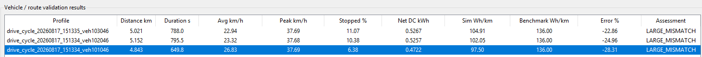

# Validation and Calibration

Currently all we have is a model with the following structure:

```
route
→ speed/grade mission profile
→ vehicle longitudinal power (power mission profile)
→ inverter electrical loss
→ junction temperature
→ rainflow cycles
→ damage index
```

To calibrate this we need to make sure every stage is tied to real data independently. *Validating only the final damage number won't fix anything*

Validation Plan:

1. **Vehicle/route layer:** compare energy consumption and speed behavior against real vehicle benchmarks.
2. **Inverter layer:** replace placeholder SiC parameters with one real MOSFET/module datasheet.
3. **Thermal layer:** validate your RC/Foster model against datasheet transient thermal impedance.
4. **Reliability layer:** replace the placeholder Coffin–Manson coefficients with published power-cycling data for a comparable package.

- Only after those are validated should you interpret absolute lifetime.


---

**Vehicle/Route Layer**

Currently I'm using a Tesla Model 3 LR RWD-Style Configuration. There are two official benchmarks for this:

- U.S. EPA current listing of a 2025 Model 3 Long Range RWD at 25 kWh/100 mi, which is about 155 Wh/km combined.
- Tesla Germany currently lists a Model 3 RWD official WLTP consumption of 13.0 kWh/100km = 130 Wh/km
  - PDF Spec Sheet can be found the `docs/tesla_specs` folder.

I've matched the vehicle YAML config file to the Tesla Germany Model 3 Premium Long Range Rear-Wheel Drive. In this YAML file there is a benchmark stored under `validation`.

```
validation:
  benchmark_name: Tesla Model 3 Premium Long Range Rear-Wheel Drive
  market: Germany
  certification_cycle: WLTP_combined
  official_consumption_kwh_per_100km: 13.6
  official_consumption_wh_per_km: 136.0
  official_mass_kg: 1822
  official_rear_motor_power_kw: 235
  benchmark_purpose: vehicle_layer_validation
```

For this, I will be doing two separate checks: **energy plausibility** and **speed profile context**. For a recorded mission profile, I will read the `.csv` file and using the existing full route summary I will get the vehicle-layer energy values:

```
traction_energy_kwh
recovered_energy_kwh
net_dc_energy_kwh
distance_km
```

Using that I will calculate the main efficiency metric: **`consumption_wh_per_km`**.

- To calculate this: `net_energy x distance = consumption`

Then I will calculate the absolute difference in two ways:

1. Absolute Difference: simulation - benchmark
2. Percentage Error: ((simulation - benchmark) / benchmark) x 100%

- 0-10%: Good Match
- 10-20%: Review
-  \>20%: Large Mismatch


There's a second part to this, where we are looking at the driving behaviour of the mission profile. Without this, it would be misleading to compare every Stuttgart trip directly to WLTP without context.

- This second part calculates:

  ```
  duration
  distance
  average speed
  peak speed
  stopped-time percentage
  mean positive acceleration
  95th-percentile positive acceleration
  mean braking magnitude
  95th-percentile braking magnitude
  ```

- It then computes the deltas between:

  ```
  your average speed - WLTC average speed
  your peak speed    - WLTC peak speed
  your stopped %     - WLTC stopped %
  ```

This tells us whether the Stuttgart mission profile is fundamentally slower, more stop-start, or less aggressive than WLTC.

- E.g. Suppose you get:

  ```
  Simulation energy: 105 Wh/km
  Benchmark:         136 Wh/km
  Error:             -22.8%
  ```

  But then the speed statistics might say:

  ```
  Average speed: 23 km/h
  Peak speed:    52 km/h
  Stopped time:  28%
  ```

  - Which is really slow, compared to WLTC, so it makes sense that the simulation error makes sense to be -22.8%.

**Sources:**

- https://www.tesla.com/de_DE/support/european-union-energy-label?utm_source=chatgpt.com#pkw-model-3-premlrrwd

  - WLTP Benchmarks, Vehicle Parameters (for YAML)

- https://unece.org/fileadmin/DAM/trans/doc/2012/wp29grpe/WLTP-DHC-12-07e.xls

  - WLTC/WLTP is defined here.

  - For a Class 3 Cycle, the official UNECE spreadsheet contains the second-by-second speed trace.

    ```
    WLTC_CLASS3_DURATION_S = 1800.0
    WLTC_CLASS3_DISTANCE_KM = 23.266
    WLTC_CLASS3_AVERAGE_SPEED_KMH = 46.5
    WLTC_CLASS3_MAX_SPEED_KMH = 131.3
    ```

# New GUI on `visualization.py`

When you press `F7` you can now open a new window called `validation_lab_window.py`. This window will host the validation tools needed for: Vehicle/Route, Inverter, Thermal Model, and Reliability Layer, as per the validation  layers stated above.

# Tests

**Test 1: Vehicle/Route **



- Start: 172 Neckarstrasse

- Destination: HBF

- Results:

  Simulated Stuttgart routes from 172 Neckarstrasse to Stuttgart HBF show that the EGO vehicle is using substantially less energy per km than the 136 Wh/km German WLTP Benchmark.

  - Route 1: 104.91 Wh/km → **22.86% below** benchmark
  - Route 2: 102.05 Wh/km → **24.96% below** benchmark
  - Route 3: 97.50 Wh/km → **28.31% below **benchmark

  The pattern is somewhat consistent around 20-30% lower consumption than the benchmark.

  Notably, the routes are much slower than the WLTC-style driving, as the average speeds are only about 23-27 km/h, and the peak speeds are about 38 km/h, and there is some stopped percentage.

  - What this means is that, yes it's below benchmark, however that doesn't mean the model is wrong, since thee routes are averaging (and peaking) speeds that are less than WLTC-style driving there is little or no auxiliary load.
  - This tells us that we should check if the Net DC energy includes all the losses we want at the battery side such as:
    - Auxiliary Electrical Load (HVAC, lights, infotainment setups, windshield wipers, ECUs), Drivetrain efficiency, regen efficiency, and rolling resistance.

- Next Steps:

  - I will not tune the YAML yet, rather I will extend the validation tab with an energy breakdown showing:

    ```
    Aerodynamic energy
    Rolling-resistance energy
    Acceleration/inertial energy
    Grade energy
    Drivetrain losses
    Recovered regen energy
    Auxiliary energy
    Net battery energy
    ```

    

