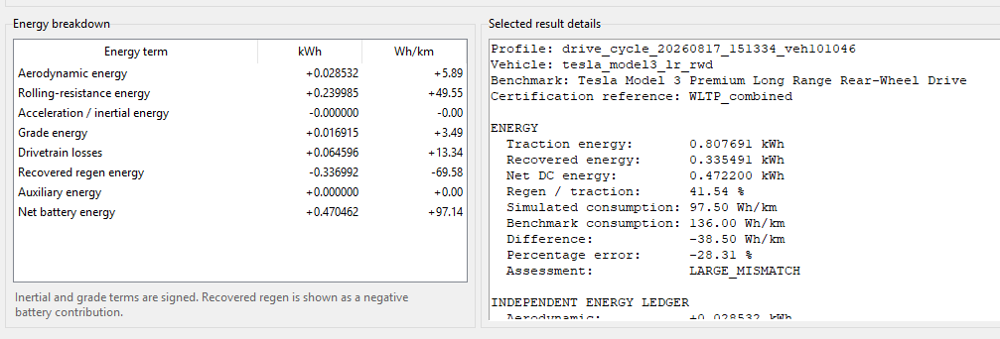
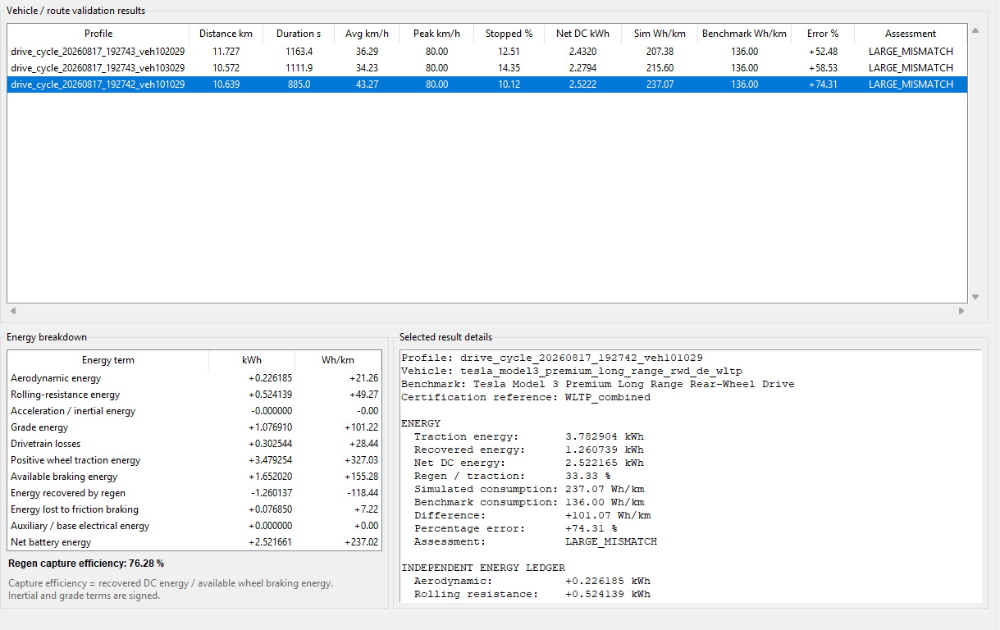
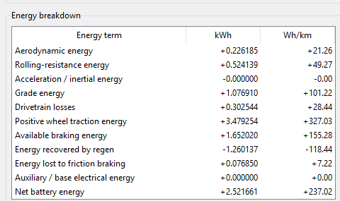
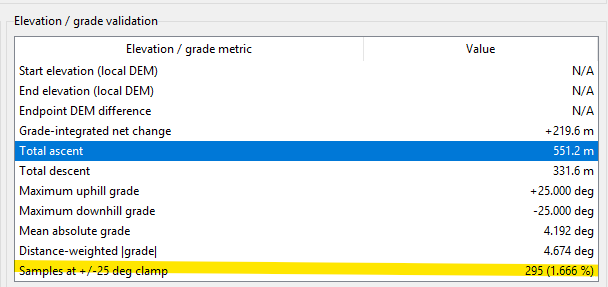
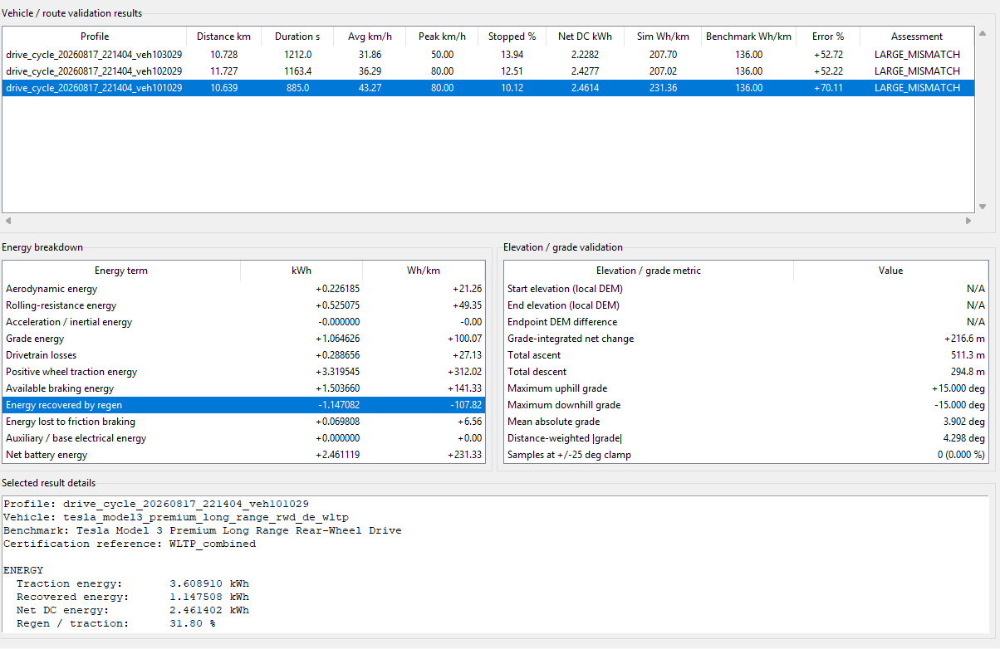
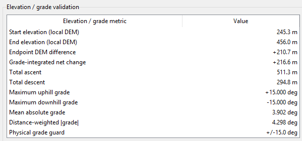
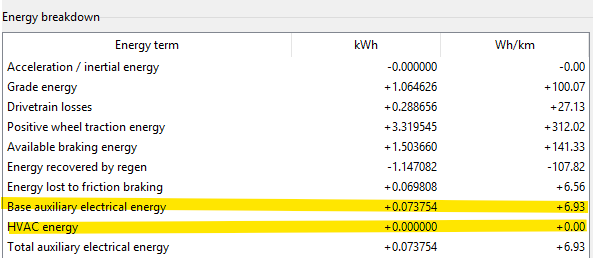

# Validation and Calibration

Currently all we have is a model with the following structure:

```
route
→ speed/grade mission profile
→ vehicle longitudinal power (power mission profile)
→ inverter electrical loss
→ junction temperature
→ rainflow cycles
→ damage index
```

To calibrate this we need to make sure every stage is tied to real data independently. *Validating only the final damage number won't fix anything*

Validation Plan:

1. **Vehicle/route layer:** compare energy consumption and speed behavior against real vehicle benchmarks.
2. **Inverter layer:** replace placeholder SiC parameters with one real MOSFET/module datasheet.
3. **Thermal layer:** validate your RC/Foster model against datasheet transient thermal impedance.
4. **Reliability layer:** replace the placeholder Coffin–Manson coefficients with published power-cycling data for a comparable package.

- Only after those are validated should you interpret absolute lifetime.


---

**Vehicle/Route Layer**

Currently I'm using a Tesla Model 3 LR RWD-Style Configuration. There are two official benchmarks for this:

- U.S. EPA current listing of a 2025 Model 3 Long Range RWD at 25 kWh/100 mi, which is about 155 Wh/km combined.
- Tesla Germany currently lists a Model 3 RWD official WLTP consumption of 13.0 kWh/100km = 130 Wh/km
  - PDF Spec Sheet can be found the `docs/tesla_specs` folder.

I've matched the vehicle YAML config file to the Tesla Germany Model 3 Premium Long Range Rear-Wheel Drive. In this YAML file there is a benchmark stored under `validation`.

```
validation:
  benchmark_name: Tesla Model 3 Premium Long Range Rear-Wheel Drive
  market: Germany
  certification_cycle: WLTP_combined
  official_consumption_kwh_per_100km: 13.6
  official_consumption_wh_per_km: 136.0
  official_mass_kg: 1822
  official_rear_motor_power_kw: 235
  benchmark_purpose: vehicle_layer_validation
```

For this, I will be doing two separate checks: **energy plausibility** and **speed profile context**. For a recorded mission profile, I will read the `.csv` file and using the existing full route summary I will get the vehicle-layer energy values:

```
traction_energy_kwh
recovered_energy_kwh
net_dc_energy_kwh
distance_km
```

Using that I will calculate the main efficiency metric: **`consumption_wh_per_km`**.

- To calculate this: `net_energy x distance = consumption`

Then I will calculate the absolute difference in two ways:

1. Absolute Difference: simulation - benchmark
2. Percentage Error: ((simulation - benchmark) / benchmark) x 100%

- 0-10%: Good Match
- 10-20%: Review
-  \>20%: Large Mismatch


There's a second part to this, where we are looking at the driving behaviour of the mission profile. Without this, it would be misleading to compare every Stuttgart trip directly to WLTP without context.

- This second part calculates:

  ```
  duration
  distance
  average speed
  peak speed
  stopped-time percentage
  mean positive acceleration
  95th-percentile positive acceleration
  mean braking magnitude
  95th-percentile braking magnitude
  ```

- It then computes the deltas between:

  ```
  your average speed - WLTC average speed
  your peak speed    - WLTC peak speed
  your stopped %     - WLTC stopped %
  ```

This tells us whether the Stuttgart mission profile is fundamentally slower, more stop-start, or less aggressive than WLTC.

- E.g. Suppose you get:

  ```
  Simulation energy: 105 Wh/km
  Benchmark:         136 Wh/km
  Error:             -22.8%
  ```

  But then the speed statistics might say:

  ```
  Average speed: 23 km/h
  Peak speed:    52 km/h
  Stopped time:  28%
  ```

  - Which is really slow, compared to WLTC, so it makes sense that the simulation error makes sense to be -22.8%.

**Sources:**

- https://www.tesla.com/de_DE/support/european-union-energy-label?utm_source=chatgpt.com#pkw-model-3-premlrrwd

  - WLTP Benchmarks, Vehicle Parameters (for YAML)

- https://unece.org/fileadmin/DAM/trans/doc/2012/wp29grpe/WLTP-DHC-12-07e.xls

  - WLTC/WLTP is defined here.

  - For a Class 3 Cycle, the official UNECE spreadsheet contains the second-by-second speed trace.

    ```
    WLTC_CLASS3_DURATION_S = 1800.0
    WLTC_CLASS3_DISTANCE_KM = 23.266
    WLTC_CLASS3_AVERAGE_SPEED_KMH = 46.5
    WLTC_CLASS3_MAX_SPEED_KMH = 131.3
    ```

# New GUI on `visualization.py`

When you press `F7` you can now open a new window called `validation_lab_window.py`. This window will host the validation tools needed for: Vehicle/Route, Inverter, Thermal Model, and Reliability Layer, as per the validation  layers stated above.

# Tests

**Test 1: Vehicle/Route **


- Start: 172 Neckarstrasse

- Destination: HBF

- Results:

  Simulated Stuttgart routes from 172 Neckarstrasse to Stuttgart HBF show that the EGO vehicle is using substantially less energy per km than the 136 Wh/km German WLTP Benchmark.

  - Route 1: 104.91 Wh/km → **22.86% below** benchmark
  - Route 2: 102.05 Wh/km → **24.96% below** benchmark
  - Route 3: 97.50 Wh/km → **28.31% below **benchmark

  The pattern is somewhat consistent around 20-30% lower consumption than the benchmark.

  Notably, the routes are much slower than the WLTC-style driving, as the average speeds are only about 23-27 km/h, and the peak speeds are about 38 km/h, and there is some stopped percentage.

  - What this means is that, yes it's below benchmark, however that doesn't mean the model is wrong, since thee routes are averaging (and peaking) speeds that are less than WLTC-style driving there is little or no auxiliary load.
  - This tells us that we should check if the Net DC energy includes all the losses we want at the battery side such as:
    - Auxiliary Electrical Load (HVAC, lights, infotainment setups, windshield wipers, ECUs), Drivetrain efficiency, regen efficiency, and rolling resistance.

- Next Steps:

  - I will not tune the YAML yet, rather I will extend the validation tab with an energy breakdown showing:

    ```
    Aerodynamic energy
    Rolling-resistance energy
    Acceleration/inertial energy
    Grade energy
    Drivetrain losses
    Recovered regen energy
    Auxiliary energy
    Net battery energy
    ```

    I've since updated the validation tab for Vehicle/Route (`vehicle_route_validation.py, validation_lab_window.py`)


**Test 2: Vehicle/Route**

- Start: 172 Neckarstrasse

- Destination: HBF

- Results: (same as before)

  Simulated Stuttgart routes from 172 Neckarstrasse to Stuttgart HBF show that the EGO vehicle is using substantially less energy per km than the 136 Wh/km German WLTP Benchmark.

  - Route 1: 104.91 Wh/km → **22.86% below** benchmark
  - Route 2: 102.05 Wh/km → **24.96% below** benchmark
  - Route 3: 97.50 Wh/km → **28.31% below **benchmark

  

  Notable information from the new window:

  - Aerodynamic Contribution is 5.9 Wh/km, which is very small but it makes sense as the route is slow.
  - 41.5% recovered-energy fraction is quite aggressive.
    - This is the portion of kinetic and potential energy captured during braking that is successfully converted back into usable electricity. On average, cars recover about **23%** under the WLTP cycle.
  - Auxiliary Energy = 0
    - Right now, the simulated car uses no energy for pumps, computers, coolant circulation, battery management, lights, cabin electronics, etc.

- What this tells us about the model?

  1. Regeneration is way to optimistic, 41.5% is too much.
  2. Auxiliary consumption is completely absent. 
  3. The route itself is not comparable to WLTC, the average speed is only 26.8 km/h and peak is 37.7km/h, whereas WLTC class 3 contains much faster driving.
     1. 

- What to do next?

  1. For regeneration, I will split the regeneration section into:

     ```
     Positive wheel traction energy
     Available braking energy
     Energy recovered by regen
     Energy lost to friction braking
     Regen capture efficiency
     Auxiliary/base electrical energy
     ```

     Then introduce a realistic regen model with low-speed fade and friction brake blending.

  2. For the auxiliary consumption I will add a configurable auxiliary load.

  3. For the route not being comparable to WLTC class 3, I will feed the EGO vehicle into a WLTC Class 3 Speed Trace and then compare to the German WLTP benchmark.

---

Files Update: (For Regeneration Model) 

- `regen_model.py`: Added the reusable regeneration logic that applies low-speed fade, regen power limiting, and splits braking between regenerative and friction braking.
- `vehicle_config.py`: Extended the vehicle configuration loader so the YAML can define `regen_cutoff_speed_mps` and `regen_full_speed_mps`
- `vehicle_dynamics.py`: Updated the live vehicle physics so braking now uses the new realistic regen/friction blending instead of assuming all negative wheel power can be regenerated.
- `longitudinal_profile.py`: updated the offline drive-cycle energy calculation to use the exact same regen model as the live simulation.
- `vehicle_route_validation.py`: expanded the validation calculations to report available braking energy, recovered regen energy, friction-brake loss, and mission-level regen capture efficiency
- `validation_lab_window.py`: updated the `F7` GUI so that in the Vehicle/Route tab visibly shows the new detailed braking and regeneration energy breakdown.
- `tesla_model3_lr_rwd.yaml`: defined `regen_cutoff_speed_mps` and `regen_full_speed_mps` based of uncalibrated modelling assumptions.

---

**Test 3: Vehicle/Route**

- Start: 172 Neckarstrasse

- Destination: 47 Pfaffenwaldring

- Results:

  

  - This will tell me where the extra energy is coming from.

  - We see there is a big difference between the simulated consumption and the benchmark:

    ```
    Simulated consumption     237.07 Wh/km
    German WLTP benchmark     136.00 Wh/km
    Difference               +101.07 Wh/km
    ```

  - From the breakdown we see that the route elevation is the main reason for  the high consumption. 

    

  - Is 237.08 Wh/km result correct?

    It actually might be.

    So YES:
    The Neckarstraße -> Pfaffenwaldring route genuinely climbs
    roughly a couple hundred meters, so it should consume noticeably more than a flat WLTP-type drive.

    BUT:
    The current DEM grade trace has too many sharp artefacts, so
    237 Wh/km may be overstated.

    

---

**Calibration**: To fix the elevation data issue, we are going to follow this pipeline now:

```
raw DEM elevations
        ↓
reject isolated peak/trough spikes
        ↓
distance-based smoothing over 25 m
        ↓
calculate grade across a 25 m baseline
        ↓
apply final ±15° road-grade sanity guard
```

- This preserves raw start and end elevations
- Rejects spikes when the elevation jumps sharply up/down which is typically DEM noise
- Grade is no longer calculated between tiny adjacent OSM nodes.
- The 25m baseline means several short segments effectively share the same slope

---

**Test 4: Vehicle/Route**

- Start: 172 Neckarstrasse

- Destination: 47 Pfaffenwaldring

- Results:

  

  - The smoothing worked, the ~217m net climb looks physically possible, but now there is evidence that some grades are hitting the new +- 15 degrees cap.

  - Need to see why this is happening, so and update to the validation lab window.

    - Officially validated: It's because its actually going up and down hills. We can see this in the updated `F7` panel.

      

---

**Update:** Auxiliary Model

```
auxiliary_model.py
vehicle_config.py
vehicle_dynamics.py
longitudinal_profile.py
route_summary.py
vehicle_route_validation.py
validation_lab_window.py
Code
tesla_model3_lr_rwd.yaml
```

- All of this was updated so that `auxiliary_model.py` can be added.

  - You can enable and disable the HVAC (in the YAML config file)
    - disable for WLTP-oriented comparison

- Here is the energy details in the new validation lab window:

  


