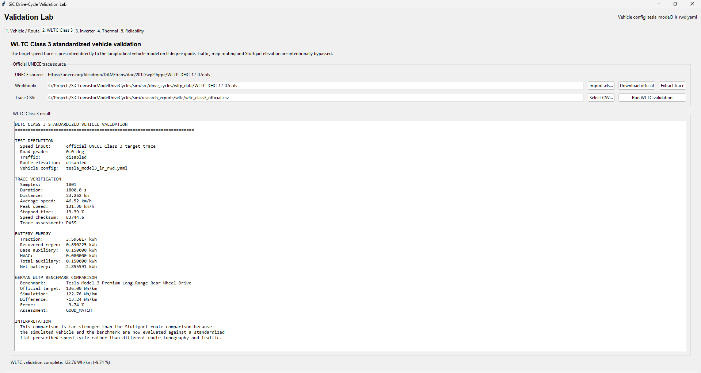

# Validation and Calibration (2)

Currently all we have is a model with the following structure:

```
route
→ speed/grade mission profile
→ vehicle longitudinal power (power mission profile)
→ inverter electrical loss
→ junction temperature
→ rainflow cycles
→ damage index
```

To calibrate this we need to make sure every stage is tied to real data independently. *Validating only the final damage number won't fix anything*

Validation Plan:

1. **Vehicle/route layer:** compare energy consumption and speed behavior against real vehicle benchmarks.
2. **Inverter layer:** replace placeholder SiC parameters with one real MOSFET/module datasheet.
3. **Thermal layer:** validate your RC/Foster model against datasheet transient thermal impedance.
4. **Reliability layer:** replace the placeholder Coffin–Manson coefficients with published power-cycling data for a comparable package.

- Only after those are validated should you interpret absolute lifetime.

---

In this document, I will be making the EGO vehicle ride in a route comparable to WLTC class 3.

- This way I can make a really clean validation than using Stuttgart roads.

**New/Updated Scripts**

- `wltc_class3_validation.py`:
- `validation_lab_window.py`: This is the `F7` GUI, it has been updated to include WLTC Class 3 tab (`wltc_class3_validation.py`)

Prerequisites:

```bash
python -m pip install xlrd
Download the WLTP-DHC-12-07e.xls: https://unece.org/fileadmin/DAM/trans/doc/2012/wp29grpe/WLTP-DHC-12-07e.xls
```

- I stored the file here: `sim\src\drive_cycles\wltp_data\WLTP-DHC-12-07e.xls`
  - The `WLTP-DHC-12-07e.xls` file is the WLTC Class 3 Official trace.

**Conceptual Pipeline:**

```
Official WLTC Class 3 speed trace
        ↓
same Tesla vehicle physics
        ↓
flat road, no traffic
        ↓
traction + regen + auxiliaries
        ↓
predicted battery Wh/km
        ↓
compare against 136 Wh/km
```

**Usage:**

1. The WLTC Class 3 tab gets the official UNECE speed trace, and it is just a table of target vehicle speed versus time vs 1800 seconds. Then the script extracts that into a CSV file. 

   ```
   time_s,v_mps,grade_deg
   0,0.0,0.0
   1,...
   2,...
   ...
   1800,...
   ```

   1. With `grade_deg = 0` for this standardized test.

2. Then the CSV (which acts as a mission profile) will feed into the existing Vehicle Energy Power Mission Profile (longitudinal vehicle model). 

   1. In essence, the ego car is no longer going through Stuttgart traffic, but instead is being told what speed the vehicle should be going at what timestep.
   2. This calculates **acceleration, rolling resistance, aerodynamic drag, drivetrain losses, regen, base auxiliary load, and battery energy**.

3. Then the total battery energy is converted into `Wh/km = net battery energy / WLTC distance`

   1. This is then compared directly to the German benchmark stored in the YAML, which is currently 136 Wh/km.

   

**Performing The Test**



- This gave great initial results, the vehicle model predicts: 122.76 Wh/km against the stored German target: 136.00 Wh/km. Which gives a difference of -13.24 Wh/km, or -9.74%.
- The next step for calibration is adding a calibration panel where I can **edit parameters** one at a time, and see which parameter is causing the missing 13.24 Wh/km instead of guessing.

**Parameters**

There are four main parameters that affect the vehicle energy, which are:

1. **Rolling Resistance Coefficient (`Crr`)**
   - This represents the energy lost because the tires deform as they roll. A higher `Crr` means more force is needed just to keep the car moving, especially at low and medium speeds.
     - `F_roll = mass × g × Crr`
2. **Drivetrain efficiency**
   - In YAML, it is currently set to 0.92, means that 92% of the energy gets to the wheels, and 8% is lost to the motor/inverter/drivetrain. Lower efficiency increases battery consumption.
3. **Regenerative efficiency**
   - In YAML, it is currently set to 0.80, this is before other limits like low-speed fade and max regen power.
4. **Base auxiliary power**
   - In YAML, it is set to 300W, this is the constant electrical demand from systems that are not directly propelling that car, such as controllers, pumps, low-voltage electronics, BMS, etc.


