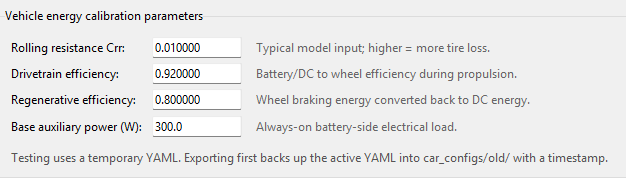
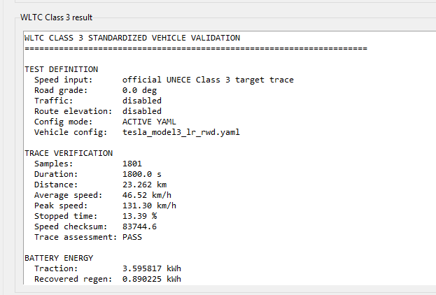
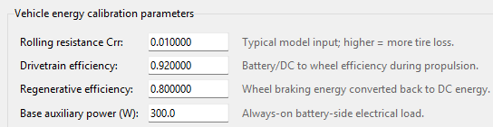
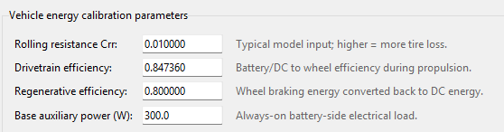
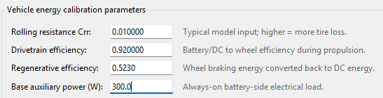
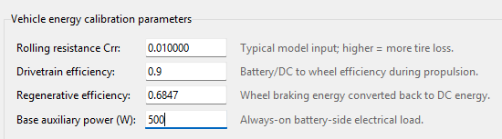

# Validation and Calibration (2)

Currently all we have is a model with the following structure:

```
route
→ speed/grade mission profile
→ vehicle longitudinal power (power mission profile)
→ inverter electrical loss
→ junction temperature
→ rainflow cycles
→ damage index
```

To calibrate this we need to make sure every stage is tied to real data independently. *Validating only the final damage number won't fix anything*

Validation Plan:

1. **Vehicle/route layer:** compare energy consumption and speed behavior against real vehicle benchmarks.
2. **Inverter layer:** replace placeholder SiC parameters with one real MOSFET/module datasheet.
3. **Thermal layer:** validate your RC/Foster model against datasheet transient thermal impedance.
4. **Reliability layer:** replace the placeholder Coffin–Manson coefficients with published power-cycling data for a comparable package.

- Only after those are validated should you interpret absolute lifetime.

---

In this document, I will be making the EGO vehicle ride in a route comparable to WLTC class 3.

- This way I can make a really clean validation than using Stuttgart roads.

**New/Updated Scripts**

- `wltc_class3_validation.py`:
- `validation_lab_window.py`: This is the `F7` GUI, it has been updated to include WLTC Class 3 tab (`wltc_class3_validation.py`)

Prerequisites:

```bash
python -m pip install xlrd
Download the WLTP-DHC-12-07e.xls: https://unece.org/fileadmin/DAM/trans/doc/2012/wp29grpe/WLTP-DHC-12-07e.xls
```

- I stored the file here: `sim\src\drive_cycles\wltp_data\WLTP-DHC-12-07e.xls`
  - The `WLTP-DHC-12-07e.xls` file is the WLTC Class 3 Official trace.

**Conceptual Pipeline:**

```
Official WLTC Class 3 speed trace
        ↓
same Tesla vehicle physics
        ↓
flat road, no traffic
        ↓
traction + regen + auxiliaries
        ↓
predicted battery Wh/km
        ↓
compare against 136 Wh/km
```

**Usage:**

1. The WLTC Class 3 tab gets the official UNECE speed trace, and it is just a table of target vehicle speed versus time vs 1800 seconds. Then the script extracts that into a CSV file. 

   ```
   time_s,v_mps,grade_deg
   0,0.0,0.0
   1,...
   2,...
   ...
   1800,...
   ```

   1. With `grade_deg = 0` for this standardized test.

2. Then the CSV (which acts as a mission profile) will feed into the existing Vehicle Energy Power Mission Profile (longitudinal vehicle model). 

   1. In essence, the ego car is no longer going through Stuttgart traffic, but instead is being told what speed the vehicle should be going at what timestep.
   2. This calculates **acceleration, rolling resistance, aerodynamic drag, drivetrain losses, regen, base auxiliary load, and battery energy**.

3. Then the total battery energy is converted into `Wh/km = net battery energy / WLTC distance`

   1. This is then compared directly to the German benchmark stored in the YAML, which is currently 136 Wh/km.

   

**Performing The Test**


- This gave great initial results, the vehicle model predicts: 122.76 Wh/km against the stored German target: 136.00 Wh/km. Which gives a difference of -13.24 Wh/km, or -9.74%.
- The next step for calibration is adding a calibration panel where I can **edit parameters** one at a time, and see which parameter is causing the missing 13.24 Wh/km instead of guessing.

**Parameters**

There are four main parameters that affect the vehicle energy, which are:

1. **Rolling Resistance Coefficient (`Crr`)**
   - This represents the energy lost because the tires deform as they roll. A higher `Crr` means more force is needed just to keep the car moving, especially at low and medium speeds.
     - `F_roll = mass × g × Crr`
2. **Drivetrain efficiency**
   - In YAML, it is currently set to 0.92, means that 92% of the energy gets to the wheels, and 8% is lost to the motor/inverter/drivetrain. Lower efficiency increases battery consumption.
3. **Regenerative efficiency**
   - In YAML, it is currently set to 0.80, this is before other limits like low-speed fade and max regen power.
4. **Base auxiliary power**
   - In YAML, it is set to 300W, this is the constant electrical demand from systems that are not directly propelling that car, such as controllers, pumps, low-voltage electronics, BMS, etc.

summary:

```Higher Crr
→ more road-load energy
→ higher Wh/km

Lower drivetrain efficiency
→ more propulsion losses
→ higher Wh/km

Lower regen efficiency
→ less energy recovered
→ higher Wh/km

Higher auxiliary power
→ more constant battery draw
→ higher Wh/km
```

**Editing Parameters**

I will create a GUI for editing these parameters: `vehicle_config_calibration.py`

- Also, updated `validation_lab_window.py` to have this GUI show up in the 2nd tab.

**Usage**

1. Make sure the official WLTC trace is ready. If you already downloaded/extracted it before, you can reuse the existing CSV. Otherwise: Download official -> Extract trace.

2. Look at the new **Vehicle energy calibration parameters** section. It will load the current values from your active YAML, for example:

   

3. First, click: `Run WLTC validation`. This will give you the baseline results.

4. Now edit one parameter at a time, then click `Test edited values`.

   - This does not overwrite your YAML. It instead creates a temporary config and runs WLTC with those values.

5. Look at the new result, if the result is any good, then export them and make them active by pressing `Export / make active`

   - This will take the current YAML file, timestamp it, and put it in the same directory, but in a folder called `old`.

6. If not you can reset back to your active values whenever you want by pressing `Reload current YAML`

---

**Baseline for Upcoming Tests:**



**Test 1:** Adjusting hyperparameters: Adjusting Drivetrain Efficiency

Test Parameters:



Results:

```
WLTC CLASS 3 STANDARDIZED VEHICLE VALIDATION
======================================================================

TEST DEFINITION
  Speed input:      official UNECE Class 3 target trace
  Road grade:       0.0 deg
  Traffic:          disabled
  Route elevation:  disabled
  Config mode:      TEMPORARY EDITED VALUES
  Vehicle config:   temporary_calibration_vehicle.yaml

TRACE VERIFICATION
  Samples:          1801
  Duration:         1800.0 s
  Distance:         23.262 km
  Average speed:    46.52 km/h
  Peak speed:       131.30 km/h
  Stopped time:     13.39 %
  Speed checksum:   83744.6
  Trace assessment: PASS

BATTERY ENERGY
  Traction:         3.904068 kWh
  Recovered regen:  0.890225 kWh
  Base auxiliary:   0.150000 kWh
  HVAC:             0.000000 kWh
  Total auxiliary:  0.150000 kWh
  Net battery:      3.163843 kWh

GERMAN WLTP BENCHMARK COMPARISON
  Benchmark:        Tesla Model 3 Premium Long Range Rear-Wheel Drive
  Official target:  136.00 Wh/km
  Simulation:       136.01 Wh/km
  Difference:       +0.01 Wh/km
  Error:            +0.00 %
  Assessment:       GOOD_MATCH
```

- As you can see the error went down to 0.00% by changing drivetrain efficiency to 0.847360.
- Now we have to validate it.
- 

**Test 2:** Adjusting Hyperparameter: Regenerative Efficiency



- Results:

  ```
  WLTC CLASS 3 STANDARDIZED VEHICLE VALIDATION
  ======================================================================
  
  TEST DEFINITION
    Speed input:      official UNECE Class 3 target trace
    Road grade:       0.0 deg
    Traffic:          disabled
    Route elevation:  disabled
    Config mode:      TEMPORARY EDITED VALUES
    Vehicle config:   temporary_calibration_vehicle.yaml
  
  TRACE VERIFICATION
    Samples:          1801
    Duration:         1800.0 s
    Distance:         23.262 km
    Average speed:    46.52 km/h
    Peak speed:       131.30 km/h
    Stopped time:     13.39 %
    Speed checksum:   83744.6
    Trace assessment: PASS
  
  BATTERY ENERGY
    Traction:         3.595817 kWh
    Recovered regen:  0.582040 kWh
    Base auxiliary:   0.150000 kWh
    HVAC:             0.000000 kWh
    Total auxiliary:  0.150000 kWh
    Net battery:      3.163777 kWh
  
  GERMAN WLTP BENCHMARK COMPARISON
    Benchmark:        Tesla Model 3 Premium Long Range Rear-Wheel Drive
    Official target:  136.00 Wh/km
    Simulation:       136.00 Wh/km
    Difference:       +0.00 Wh/km
    Error:            +0.00 %
    Assessment:       GOOD_MATCH
  ```

  - As you can see the error went down to 0.00% by changing regenerative efficiency to 0.5230.
  - Now we have to validate it.

**Allowed Calibration Ranges**

| Parameter                 | Constraint      | Why                                                          |
| ------------------------- | --------------- | ------------------------------------------------------------ |
| **Crr**                   | `0.009 – 0.012` | Keeps tire rolling resistance in a realistic passenger-EV range |
| **Drivetrain efficiency** | `0.88 – 0.96`   | Prevents using an unrealistically low efficiency just to force WLTC to match |
| **Regen efficiency**      | `0.65 – 0.85`   | Prevents regen from being tuned unrealistically low/high to absorb model error |
| **Base auxiliary power**  | `200 – 500 W`   | Keeps always-on electrical load in a plausible mild-condition range |


**Test 3: **Adjusting Hyperparameter: With Constraints

- Results

  ```
  WLTC CLASS 3 STANDARDIZED VEHICLE VALIDATION
  ======================================================================
  
  TEST DEFINITION
    Speed input:      official UNECE Class 3 target trace
    Road grade:       0.0 deg
    Traffic:          disabled
    Route elevation:  disabled
    Config mode:      TEMPORARY EDITED VALUES
    Vehicle config:   temporary_calibration_vehicle.yaml
  
  TRACE VERIFICATION
    Samples:          1801
    Duration:         1800.0 s
    Distance:         23.262 km
    Average speed:    46.52 km/h
    Peak speed:       131.30 km/h
    Stopped time:     13.39 %
    Speed checksum:   83744.6
    Trace assessment: PASS
  
  BATTERY ENERGY
    Traction:         3.675724 kWh
    Recovered regen:  0.761950 kWh
    Base auxiliary:   0.250000 kWh
    HVAC:             0.000000 kWh
    Total auxiliary:  0.250000 kWh
    Net battery:      3.163773 kWh
  
  GERMAN WLTP BENCHMARK COMPARISON
    Benchmark:        Tesla Model 3 Premium Long Range Rear-Wheel Drive
    Official target:  136.00 Wh/km
    Simulation:       136.00 Wh/km
    Difference:       +0.00 Wh/km
    Error:            +0.00 %
    Assessment:       GOOD_MATCH
  ```

  - Now I believe this the strongest candidate, and hence have exported it and made it the active YAML file for the Tesla.


