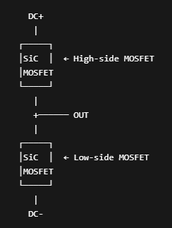
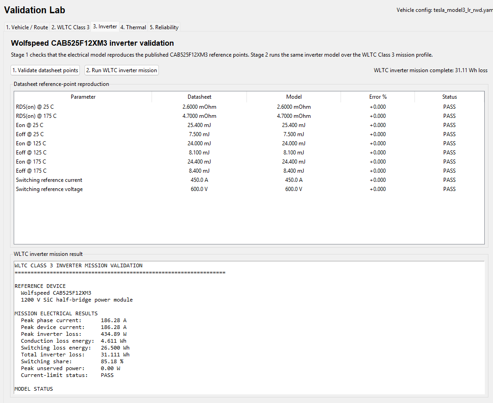

# Validation and Calibration (3)


```
route
→ speed/grade mission profile
→ vehicle longitudinal power (power mission profile)
→ inverter electrical loss
→ junction temperature
→ rainflow cycles
→ damage index
```

To calibrate this we need to make sure every stage is tied to real data independently. *Validating only the final damage number won't fix anything*

Validation Plan:

1. **Vehicle/route layer:** compare energy consumption and speed behavior against real vehicle benchmarks.
2. **Inverter layer:** replace placeholder SiC parameters with one real MOSFET/module datasheet.
3. **Thermal layer:** validate your RC/Foster model against datasheet transient thermal impedance.
4. **Reliability layer:** replace the placeholder Coffin–Manson coefficients with published power-cycling data for a comparable package.

- Only after those are validated should you interpret absolute lifetime.

---

In this document I will be working on the Inverter Layer.

I will stop using the placeholder MOSFET values and now use values that belong to an actual traction-inverter.

- I will use the `Wolfspeed CAB525F12XM3` as the SiC MOSFET Half-Bridge Module.
  - 1200 V, 2.6mΩ
  - Used for traction drives/e-mobility
  - 525 A RMS 
  - Datasheet: https://assets.wolfspeed.com/uploads/2025/02/Wolfspeed_CAB525F12XM3_data_sheet.pdf
    - I stored this pdf file under `docs/mosfet_specs`

- What is a Half-Bridge Module?

  - A SiC half-bridge module is a packaged power circuit which contains two SiC MOSFETs arranged as a half bridge. 

    

  - By switching the upper and lower MOSFETs alternately, you can make the output switch between DC+ and DC-.

  - This is the basic building block for things like:

    - EV Inverters
    - Solar Inverters
    - Motor Drives
    - DC/DC Converters
    - Industrial Power Supplies
    - On-board Chargers

  - **A three-phase inverter** uses three half-bridges, giving you six MOSFETs total (*all are NMOS*)

**Updating YAML with MOSFET Config**: `tesla_model3_lr_rwd.yaml`, now stores the updated Tesla vehicle/inverter configuration with the CAB525F12XM3 electrical and temperature-dependent switching data.

**Updating `inverter_electrical.py`**: now calculates inverter conduction and switching losses using the real Wolfspeed CAB525F12XM3 datasheet parameters instead of placeholders.

---

**Validation of Inverter Model**: There is now a new addition to the visualization GUI, check the third tab to `F7`, this hosts the validation lab for the inverter.

1. Press `Validate datasheet points`

   - Checks whether the model reproduces the CAB525F12XM3 datasheet values for:

     ```
     RDS(on) @ 25°C
     RDS(on) @ 175°C
     
     Eon @ 25°C
     Eoff @ 25°C
     
     Eon @ 125°C
     Eoff @ 125°C
     
     Eon @ 175°C
     Eoff @ 175°C
     
     Reference current = 450 A
     Reference voltage = 600 V
     ```

2. Press `Run WLTC inverter mission`

   - Runs the SiC inverter across the complete WLTC class 3 cycle and reports:

     ```
     Peak phase current
     Peak device current
     Peak inverter loss
     
     Conduction loss energy
     Switching loss energy
     Total inverter loss energy
     
     Switching-loss share
     Peak unserved power
     Current-limit status
     ```

**Test 1:** Validating 



- The datasheet reproduction is exactly what we wanted.

- Also, the WLTC inverter mission looks numerically sensible:

  ```
  Peak phase/device current: 186.28 A
  Peak inverter loss:        434.89 W
  Conduction loss energy:    4.611 Wh
  Switching loss energy:     26.500 Wh
  Total inverter loss:       31.111 Wh
  Switching share:           85.18%
  Peak unserved power:       0.00 W
  Current-limit status:      PASS
  ```

- Overall, looks good


