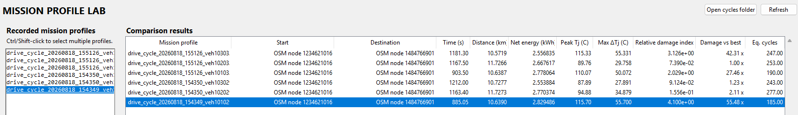

# Validation and Calibration (4)

```
route
→ speed/grade mission profile
→ vehicle longitudinal power (power mission profile)
→ inverter electrical loss
→ junction temperature
→ rainflow cycles
→ damage index
```

To calibrate this we need to make sure every stage is tied to real data independently. *Validating only the final damage number won't fix anything*

Validation Plan:

1. **Vehicle/route layer:** compare energy consumption and speed behavior against real vehicle benchmarks.
2. **Inverter layer:** replace placeholder SiC parameters with one real MOSFET/module datasheet.
3. **Thermal layer:** validate your RC/Foster model against datasheet transient thermal impedance.
4. **Reliability layer:** replace the placeholder Coffin–Manson coefficients with published power-cycling data for a comparable package.

- Only after those are validated should you interpret absolute lifetime.

---

In this document I will be working on the Thermal Layer.

- So I will be now replacing the placeholder Foster RC Network with Thermal Data tied to the Wolfspeed CAB525F12XM3 SiC Half Bridge Module.
- Then I will validate the thermal model against the module's published junction to fluid / transient thermal behaviour.


**Modified Files**

- **`thermal_model.py`** calculates the CAB525F12XM3 junction temperature over time from inverter losses using the new junction-to-fluid Foster thermal model.

- **`thermal_validation.py`** checks that the Foster thermal model matches the CAB525F12XM3 datasheet thermal impedance and evaluates the WLTC thermal mission.

- **`tesla_model3_lr_rwd.yaml`** stores the updated vehicle configuration, including the CAB525F12XM3 thermal resistance, Foster RC values, coolant temperature, and flow-rate reference.

  - Foster RC Values: derived by fitting a 4-term Foster Network to the CAB525F12XM3 datasheet's transient junction-to-fluid thermal-impedance curve.

    ```
    R1 = 0.001399 °C/W   τ1 = 2.68 µs
    R2 = 0.018321 °C/W   τ2 = 0.315 ms
    R3 = 0.088785 °C/W   τ3 = 14.35 ms
    R4 = 0.036495 °C/W   τ4 = 0.503 s
    
    ΣR = 0.145 °C/W
    ```

- **`validation_lab_window.py`** adds the working **F7 -> Thermal** GUI tab with buttons and results for datasheet thermal validation and the WLTC thermal run.


**Usage**

1. Open the Thermal GUI (F7 -> Thermal Tab)

2. Click `1. Validate Thermal Impedance`

   - This checks is the Foster Network that we created matches the CAB525F12XM3 thermal model.
   - Should say it all "PASS"s

3. Click `2. Run WLTC thermal mission` 

   - This takes the inverter losses generated while following WLTC Class 3 and feeds them through the thermal model.

   - Outputs:

     ```
     Fluid temperature
     Peak inverter loss
     Peak loss per switch position
     Peak junction temperature
     Peak Tj rise above coolant
     Total inverter loss energy
     Non-converged samples
     Over-temperature samples
     ```

**Test 1: Running Validation and WLTC Thermal Mission**

- Results:

  - All of the thermal impedance tests passed

  - ```
    WLTC CLASS 3 THERMAL MISSION VALIDATION
    ==================================================================
    
    THERMAL BOUNDARY
      Device:                   Wolfspeed CAB525F12XM3
      Fluid temperature:       60.00 C
      Flow-rate reference:      4.0 L/min per module
      Datasheet Rth,J-F:         0.145 C/W
    
        MISSION RESULTS
          Peak phase current:       186.28 A
          Peak aggregate loss:      462.99 W
          Peak loss per position:   77.17 W
          Peak junction temp:       71.17 C
          Peak Tj rise over fluid:  11.17 C
          Total inverter loss:      31.788 Wh
          Non-converged samples:    0
          Over-temperature samples: 0
    
        ASSESSMENT
          Solver convergence:       PASS
          Tj <= 175 C:              PASS
    
        MODEL STATUS
          Steady-state junction-to-fluid resistance is directly anchored to the datasheet.
          The transient Foster network is a fitted representation of Figure 17, not a manufacturer-supplied RC table.
    ```

  - This yielded great results: the thermal result looks internally consistent and is a solid pass for this stage.

  - The important numbers are:

    ```
    Peak aggregate inverter loss:   462.99 W
    Peak loss per switch position:   77.17 W
    Fluid temperature:               60.00 °C
    Peak junction temperature:       71.17 °C
    Peak Tj rise:                    11.17 °C
    Over-temperature samples:        0
    Non-converged samples:            0
    ```

    The thermal result is behaving exactly as expected.


**Tests 2:** Running F6 Mission Profile Lab to see relative damage index.



- Results:

  - Fastest route is also the worst thermally:

    ```
    885 s
    Peak Tj = 115.70°C
    Max ΔTj = 55.70°C
    Damage vs best = 55.48x
    ```

    While one of the slower profiles is much gentler:

    ```
    1212 s
    Peak Tj = 87.89°C
    Max ΔTj = 27.89°C
    Damage vs best = 1.23x
    ```

    - The reason for this is probably not speed itself, rather because faster runs require more frequent or stronger acceleration and braking, which causes:
      - Higher Inverter Current because of: higher conduction/switching losses, higher Tj, larger thermal swings, much higher fatigue damage.

  - So far the pattern is that faster / more aggressive drives cause more electrical stress -> more thermal cycling -> more semiconductor damage.


