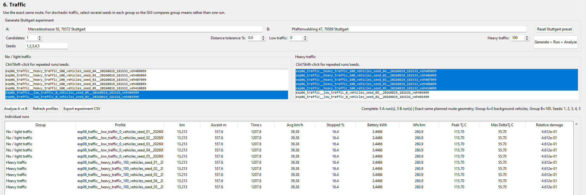
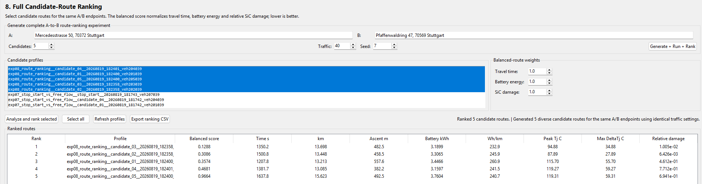

# Experiments

I want to conduct 8 different experiments and then interpret the results. In my mind, these 8 experiments will demonstrate the capabilities of the pipeline.

1. Flat vs Uphill

2. Uphill vs Downhill

   - Hoping that gives me a clean comparison of climbing traction energy vs. downhill regenerative recovery

3. Short Distance

4. Long Distance

5. Fast Road vs. Slow Road

   - Compare the same route, just compare the slower route to the faster route (in time).

6. No Traffic vs Heavy Traffic

   - Compare the same route, disable Traffic for one drive cycle, enable for the other drive cycle 

7. Stop Start vs. Free Flow

   - Compare the same route, compare five candidates, find the:
     ```
     Free-flow candidate
     = lowest stopped %
     + fewest stop events
     
     Stop-start candidate
     = highest stopped %
     + most stop events
     ```

8. Full End Goal Route Ranking

   - Generate 5 diverse route candidates, simulate all of them, then feed them into the Route Ranking.

   - Answer:

     ```
     Which is fastest?
     Which uses least battery energy?
     Which creates least SiC damage?
     Which is the best balanced route?
     ```

|   Route Type   |           sTART lOCATION           |            eND lOCATION             |
| :------------: | :--------------------------------: | :---------------------------------: |
|      Flat      | Neckarstraße 172, 70190 Stuttgart  | Mercedesstraße 50, 70372 Stuttgart  |
|     Uphill     | Neckarstraße 172, 70190 Stuttgart  | Auf dem Haigst 37, 70597 Stuttgart  |
|    Downhill    | Auf dem Haigst 37, 70597 Stuttgart |  Neckarstraße 172, 70190 Stuttgart  |
| Short Distance | Neckarstraße 172, 70190 Stuttgart  | Mercedesstraße 50, 70372 Stuttgart  |
| Long Distance  | Mercedesstraße 50, 70372 Stuttgart | Pfaffenwaldring 47, 70569 Stuttgart |

---

**Experiment 1: Flat vs Uphill **


```
Metric                    Group A mean    Group B mean      B vs A
------------------------------------------------------------------
Distance (km)                   11.268          10.639       -5.6%
Ascent (m)                       350.8           511.3      +45.8%
Time (s)                        1011.1           885.0      -12.5%
Battery (kWh)                   2.5238          2.8295      +12.1%
Peak Tj (C)                     119.27          115.70       -3.0%
Max DeltaTj (C)                  59.27           55.70       -6.0%
Relative damage              8.967e-01       4.594e-01      -48.8%
```

---

**Experiment 2: Uphill vs Downhill**


```
Metric                    Group A mean    Group B mean      B vs A
------------------------------------------------------------------
Distance (km)                    5.486           5.357       -2.3%
Ascent (m)                       250.6            54.0      -78.5%
Time (s)                         643.8           670.8       +4.2%
Battery (kWh)                   1.7059          0.0610      -96.4%
Peak Tj (C)                      80.95           82.85       +2.3%
Max DeltaTj (C)                  20.95           22.85       +9.1%
Relative damage              7.372e-04       2.432e-03     +229.9%
```

---

**Experiment 3: **


```
Metric                    Group A mean    Group B mean      B vs A
------------------------------------------------------------------
Distance (km)                    3.003           3.316      +10.4%
Ascent (m)                        50.9            81.3      +59.8%
Time (s)                         337.1           401.6      +19.1%
Battery (kWh)                   0.3197          0.4063      +27.1%
Peak Tj (C)                      82.17           81.34       -1.0%
Max DeltaTj (C)                  22.17           21.34       -3.7%
Relative damage              7.374e-04       7.266e-04       -1.5%
```

---

**Experiment 4:**


```
Metric                    Group A mean    Group B mean      B vs A
------------------------------------------------------------------
Distance (km)                   13.213          13.448       +1.8%
Ascent (m)                       557.6           458.5      -17.8%
Time (s)                        1207.8          1500.8      +24.3%
Battery (kWh)                   3.4466          3.3065       -4.1%
Peak Tj (C)                     115.70           87.89      -24.0%
Max DeltaTj (C)                  55.70           27.89      -49.9%
Relative damage              4.612e-01       6.426e-03      -98.6%
```

---

**Experiment 5:**


```
Metric                    Group A mean    Group B mean      B vs A
------------------------------------------------------------------
Distance (km)                   13.213          13.448       +1.8%
Ascent (m)                       557.6           458.5      -17.8%
Time (s)                        1207.8          1500.8      +24.3%
Battery (kWh)                   3.4466          3.3065       -4.1%
Peak Tj (C)                     115.70           87.89      -24.0%
Max DeltaTj (C)                  55.70           27.89      -49.9%
Relative damage              4.612e-01       6.426e-03      -98.6%
```

---

**Experiment 6:**

###### 

```
Metric                    Group A mean    Group B mean      B vs A
------------------------------------------------------------------
Distance (km)                   13.213          13.213       +0.0%
Ascent (m)                       557.6           557.6       +0.0%
Time (s)                        1207.8          1207.8       +0.0%
Battery (kWh)                   3.4466          3.4466       +0.0%
Peak Tj (C)                     115.70          115.70       +0.0%
Max DeltaTj (C)                  55.70           55.70       +0.0%
Relative damage              4.612e-01       4.612e-01       +0.0%

```

---

**Experiment 7**


```
Metric                    Group A mean    Group B mean      B vs A
------------------------------------------------------------------
Distance (km)                   15.450          15.408       -0.3%
Ascent (m)                       556.6           423.5      -23.9%
Time (s)                        1546.9          1610.7       +4.1%
Battery (kWh)                   3.5005          3.5825       +2.3%
Peak Tj (C)                      87.86           82.38       -6.2%
Max DeltaTj (C)                  27.86           22.38      -19.7%
Relative damage              5.775e-03       4.386e-03      -24.1%

```

---

**Experiment 8**


- Fastest: `exp08_route_ranking_candidate_01_20260819_182400_veh201039`
- Lowest Energy: `exp08_route_ranking_candidate_04_20260819_182401_veh204039`
- Lowest Damage: `exp08_route_ranking_candidate_02_20260819_182358_veh202039`
- Balanced: `exp08_route_ranking_candidate_03_20260819_182358_veh203039`


