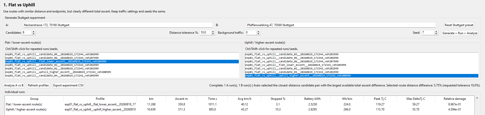
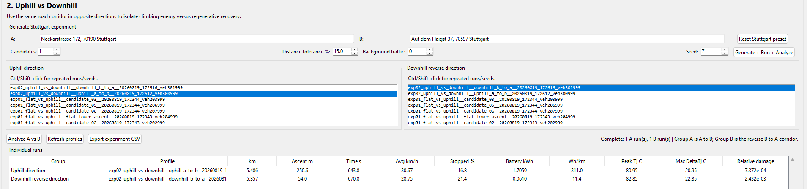
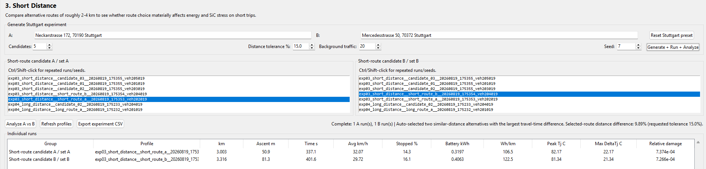
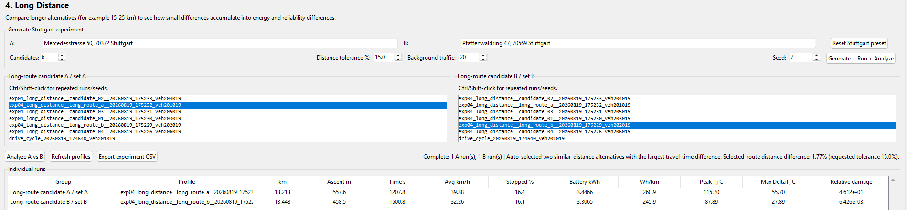
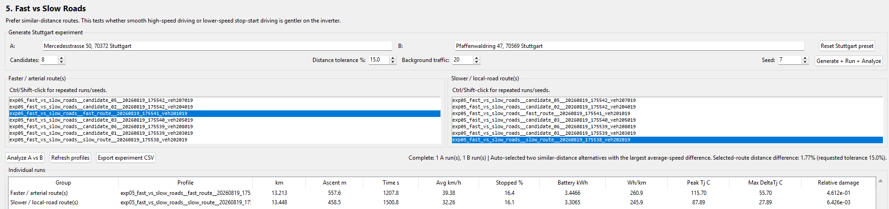
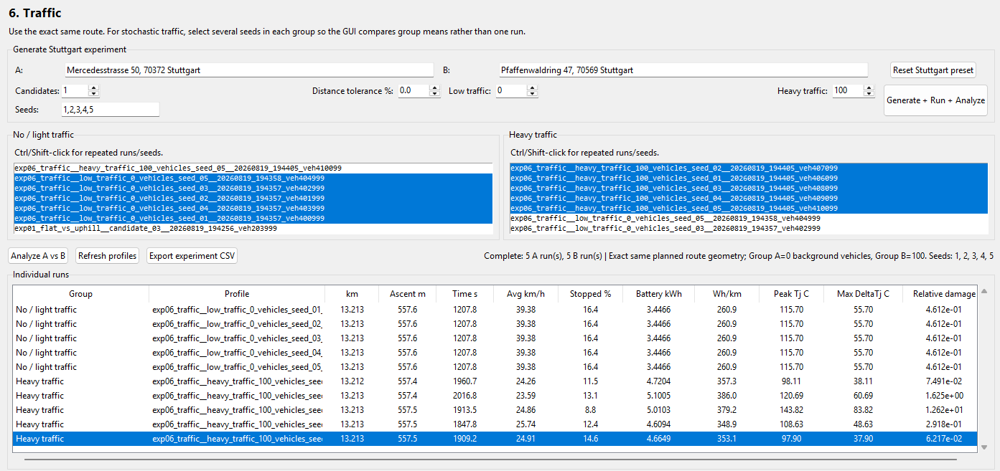
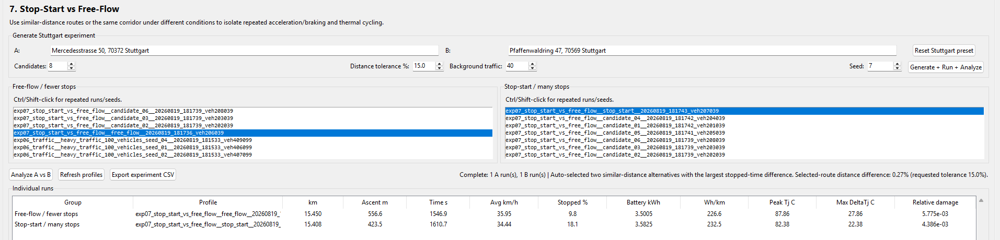
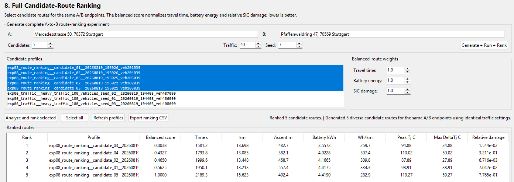

# Experiments

I want to conduct 8 different experiments and then interpret the results. In my mind, these 8 experiments will demonstrate the capabilities of the pipeline.

1. Flat vs Uphill

2. Uphill vs Downhill

   - Hoping that gives me a clean comparison of climbing traction energy vs. downhill regenerative recovery

3. Short Distance

4. Long Distance

5. Fast Road vs. Slow Road

   - Compare the same route, just compare the slower route to the faster route (in time).

6. No Traffic vs Heavy Traffic

   - Compare the same route, disable Traffic for one drive cycle, enable for the other drive cycle 

7. Stop Start vs. Free Flow

   - Compare the same route, compare five candidates, find the:
     ```
     Free-flow candidate
     = lowest stopped %
     + fewest stop events
     
     Stop-start candidate
     = highest stopped %
     + most stop events
     ```

8. Full End Goal Route Ranking

   - Generate 5 diverse route candidates, simulate all of them, then feed them into the Route Ranking.

   - Answer:

     ```
     Which is fastest?
     Which uses least battery energy?
     Which creates least SiC damage?
     Which is the best balanced route?
     ```

|   Route Type   |           sTART lOCATION           |            eND lOCATION             |
| :------------: | :--------------------------------: | :---------------------------------: |
|      Flat      | Neckarstraße 172, 70190 Stuttgart  | Mercedesstraße 50, 70372 Stuttgart  |
|     Uphill     | Neckarstraße 172, 70190 Stuttgart  | Auf dem Haigst 37, 70597 Stuttgart  |
|    Downhill    | Auf dem Haigst 37, 70597 Stuttgart |  Neckarstraße 172, 70190 Stuttgart  |
| Short Distance | Neckarstraße 172, 70190 Stuttgart  | Mercedesstraße 50, 70372 Stuttgart  |
| Long Distance  | Mercedesstraße 50, 70372 Stuttgart | Pfaffenwaldring 47, 70569 Stuttgart |

---

**Experiment 1: Flat vs Uphill **



```
Metric                    Group A mean    Group B mean      B vs A
------------------------------------------------------------------
Distance (km)                   11.268          10.639       -5.6%
Ascent (m)                       350.8           511.3      +45.8%
Time (s)                        1011.1           885.0      -12.5%
Battery (kWh)                   2.5238          2.8295      +12.1%
Peak Tj (C)                     119.27          115.70       -3.0%
Max DeltaTj (C)                  59.27           55.70       -6.0%
Relative damage              8.967e-01       4.594e-01      -48.8%
```

---

**Experiment 2: Uphill vs Downhill**



```
Metric                    Group A mean    Group B mean      B vs A
------------------------------------------------------------------
Distance (km)                    5.486           5.357       -2.3%
Ascent (m)                       250.6            54.0      -78.5%
Time (s)                         643.8           670.8       +4.2%
Battery (kWh)                   1.7059          0.0610      -96.4%
Peak Tj (C)                      80.95           82.85       +2.3%
Max DeltaTj (C)                  20.95           22.85       +9.1%
Relative damage              7.372e-04       2.432e-03     +229.9%
```

---

**Experiment 3: **



```
Metric                    Group A mean    Group B mean      B vs A
------------------------------------------------------------------
Distance (km)                    3.003           3.316      +10.4%
Ascent (m)                        50.9            81.3      +59.8%
Time (s)                         337.1           401.6      +19.1%
Battery (kWh)                   0.3197          0.4063      +27.1%
Peak Tj (C)                      82.17           81.34       -1.0%
Max DeltaTj (C)                  22.17           21.34       -3.7%
Relative damage              7.374e-04       7.266e-04       -1.5%
```

---

**Experiment 4:**



```
Metric                    Group A mean    Group B mean      B vs A
------------------------------------------------------------------
Distance (km)                   13.213          13.448       +1.8%
Ascent (m)                       557.6           458.5      -17.8%
Time (s)                        1207.8          1500.8      +24.3%
Battery (kWh)                   3.4466          3.3065       -4.1%
Peak Tj (C)                     115.70           87.89      -24.0%
Max DeltaTj (C)                  55.70           27.89      -49.9%
Relative damage              4.612e-01       6.426e-03      -98.6%
```

---

**Experiment 5:**



```
Metric                    Group A mean    Group B mean      B vs A
------------------------------------------------------------------
Distance (km)                   13.213          13.448       +1.8%
Ascent (m)                       557.6           458.5      -17.8%
Time (s)                        1207.8          1500.8      +24.3%
Battery (kWh)                   3.4466          3.3065       -4.1%
Peak Tj (C)                     115.70           87.89      -24.0%
Max DeltaTj (C)                  55.70           27.89      -49.9%
Relative damage              4.612e-01       6.426e-03      -98.6%
```

---

**Experiment 6:**



```
Metric                    Group A mean    Group B mean      B vs A
------------------------------------------------------------------
Distance (km)                   13.213          13.213       -0.0%
Ascent (m)                       557.6           557.5       -0.0%
Time (s)                        1207.8          1929.6      +59.8%
Battery (kWh)                   3.4466          4.8211      +39.9%
Peak Tj (C)                     115.70          113.83       -1.6%
Max DeltaTj (C)                  55.70           53.83       -3.4%
Relative damage              4.612e-01       2.935e+00     +536.3%

```

**Experiment 7**


```
Metric                    Group A mean    Group B mean      B vs A
------------------------------------------------------------------
Distance (km)                   15.450          15.408       -0.3%
Ascent (m)                       556.6           423.5      -23.9%
Time (s)                        1546.9          1610.7       +4.1%
Battery (kWh)                   3.5005          3.5825       +2.3%
Peak Tj (C)                      87.86           82.38       -6.2%
Max DeltaTj (C)                  27.86           22.38      -19.7%
Relative damage              5.775e-03       4.386e-03      -24.1%

```

---

**Experiment 8**


- **Fastest route:** Candidate 03
- **Lowest-energy route:** Candidate 03
- **Lowest SiC-damage route:** Candidate 02
- **Best equally weighted overall route:** Candidate 03

# Experiment Findings

**Experiment 1 — Flat vs Uphill**

The uphill route had **45.8% more ascent** and consumed **12.1% more battery energy**, which is physically consistent with the additional gravitational energy required. However, it produced lower semiconductor temperatures and substantially less fatigue damage: peak Tj fell from 119.27°C to 115.70°C, maximum ΔTj fell by 6%, and relative damage fell by **48.8%**. 

The important finding is that **higher vehicle energy demand does not necessarily correspond to greater SiC fatigue**. A sustained climb may create relatively steady semiconductor loading, whereas the nominally flatter route may contain stronger acceleration, braking, power reversals, and repeated heating/cooling cycles. In this experiment, the flat route produced about **1.95× more modeled SiC damage per trip**. 

**Conclusion:** Flat was better for battery energy, while uphill was better for predicted SiC lifetime. However, this is not a pure grade-only comparison because distance and driving behavior also differ, so the result should not be generalized to mean that flat roads are inherently worse for SiC devices. 


**Experiment 2 — Uphill vs Downhill**

This experiment provides a particularly strong contrast between **battery energy flow and semiconductor stress**. Going downhill reduced net battery consumption from 1.7059 kWh to only 0.0610 kWh—a **96.4% reduction**. 

Despite this, the downhill route generated slightly higher peak Tj, a larger ΔTj, and approximately **3.3× greater modeled SiC fatigue damage**. Regenerative braking reduces net battery consumption, but current still passes through the inverter, switching continues, and repeated traction-to-regeneration transitions can create thermal oscillations. 

**Conclusion:** Uphill was worst for battery energy, but downhill was worst for SiC fatigue. This clearly demonstrates that **low net battery consumption does not imply low inverter stress**. 


**Experiment 3 — Short Distance**

Route B was 10.4% longer, had nearly 60% more ascent, took 19.1% longer, and consumed **27.1% more battery energy** than Route A. 

However, the thermal and reliability results were almost identical. Damage differed by only **1.5%**, while peak Tj and maximum ΔTj differed by only around 1–4%. 

This suggests that, over short missions, additional energy consumption does not necessarily create sufficiently different semiconductor temperature cycles. Thermal inertia can filter short-duration variations in power demand.

**Conclusion:** Route choice has a significant effect on energy consumption here, but essentially **no meaningful effect on predicted SiC fatigue**. For these routes, energy and journey-time considerations should dominate the decision. 


**Experiment 4 — Long Distance**

This is one of the strongest experiments. The routes differed in distance by only 1.8%, and Route B used just **4.1% less battery energy**. Yet its thermal behavior was dramatically better. 

Peak Tj dropped from 115.70°C to 87.89°C, while maximum ΔTj fell from 55.70°C to 27.89°C. Relative damage dropped from 0.4612 to 0.006426, meaning Route A generated approximately **72× more modeled fatigue damage per journey**. 

This large difference results from the nonlinear nature of thermal-fatigue accumulation: reducing thermal-cycle amplitude does not merely reduce damage proportionally; it can reduce it dramatically.

**Conclusion:** Two routes with almost identical distance and relatively similar energy consumption can have radically different consequences for SiC reliability. Route B produces approximately **72× lower accumulated relative fatigue damage per trip** under the model. 


**Experiment 5 — Fast Road vs Slow Road**

The numerical results are **identical to Experiment 4**, including distance, ascent, duration, battery use, peak temperature, and fatigue damage. 

The faster route therefore appears to have substantially greater thermal and lifetime stress, but this experiment does **not isolate speed**. Ascent differs by almost 18%, and other differences in acceleration behavior, geometry, and driving conditions may also contribute. 

**Conclusion:** The result is conceptually consistent with the idea that aggressive or higher-speed driving can increase inverter stress, but Experiment 5 is currently **confounded and not independent of Experiment 4**. A stronger experiment would use the same route geometry and elevation with controlled differences in speed profile. 


**Experiment 6 — No Traffic vs Heavy Traffic**

For the same 13.2 km route, simulated heavy traffic increased mean journey time by approximately **60%** and battery consumption by approximately **40%**. More importantly, mean modeled SiC relative fatigue damage increased by approximately **6.4×** despite a slight reduction in mean peak junction temperature and maximum thermal excursion. This indicates that traffic-induced reliability stress is governed not only by peak temperature, but by the number, sequence and duration of thermal cycles generated by repeated changes in vehicle operating state. The large variation between stochastic traffic seeds further shows that specific traffic trajectories can strongly influence semiconductor fatigue.


**Experiment 7 — Stop-Start vs Free-Flow**

The selected routes successfully differed in stopped percentage: **9.8% for free flow versus 18.1% for stop-start**. However, the stop-start route produced lower peak Tj, smaller ΔTj, and approximately **24% less relative SiC damage**. 

This shows that the **number of stops itself is not the fatigue mechanism**. Low-speed stop-start operation may involve relatively modest power bursts, whereas freer-flow driving can create higher sustained loading or stronger acceleration demands.

There is also a major confounding variable: ascent falls from 556.6 m to 423.5 m, a reduction of roughly 24%. Additionally, stop-event count is not reported even though it was part of the intended selection criterion. 

**Conclusion:** For these particular routes, the stop-start candidate is gentler on the SiC module. The experiment supports the broader finding that thermal-cycle magnitude and duration matter more than simply counting stops, but additional controls are needed before isolating stop-start behavior itself. 


**Experiment 8 — Full Route Ranking**

Fastest route → Candidate 03
Lowest-energy route → Candidate 03
Lowest SiC-damage route → Candidate 02
Best equally weighted overall route → Candidate 03

With equal weighting of travel time, battery energy, and SiC fatigue damage, Candidate 03 provides the best overall route. It is both the fastest and lowest-energy candidate while retaining relatively low semiconductor fatigue. Candidate 02 minimizes SiC fatigue specifically, demonstrating that the reliability-optimal route is not necessarily the same as the overall performance-optimal route.


# Overall Results

- **Battery energy and SiC fatigue are not directly correlated.** Routes that consume more battery energy do not necessarily cause more semiconductor damage. 

- **Junction-temperature cycling is the key reliability driver.** Large thermal excursions, repeated heating/cooling events, and the overall thermal history are more important than energy consumption alone.

- **Uphill driving increased energy consumption but did not produce the worst SiC damage.** In Experiment 1, the uphill route used 12.1% more energy but produced 48.8% less relative damage. 

- **Regenerative/downhill driving can still stress the inverter.** Experiment 2 reduced net battery energy by 96.4%, yet SiC damage increased by about 3.3×, showing that low net energy does not mean low inverter stress. 

- **Short routes showed little reliability difference.** Experiment 3 had a 27.1% difference in battery use but only a 1.5% difference in modeled SiC damage, suggesting thermal inertia can reduce the effect of short-term power differences. 

- **Similar-distance routes can have radically different SiC reliability.** In Experiment 4, two routes differed in distance by only 1.8%, but one produced approximately **72× more modeled fatigue damage**. 

- **Experiment 5 suggests faster/aggressive operation can increase SiC stress, but the result is confounded.** It currently duplicates Experiment 4 and does not isolate speed from elevation and route differences. 

- **Heavy traffic was strongly detrimental to modeled SiC reliability.** On the same 13.2 km route, heavy traffic increased journey time by about **60%**, battery consumption by about **40%**, and mean relative SiC damage by about **536%**, or approximately **6.4×**. 

- **Heavy traffic caused much greater fatigue without increasing peak temperature.** Mean peak Tj actually decreased slightly, showing that reliability depends on the number, sequence, and duration of thermal cycles rather than peak temperature alone. 

- **Stop-start driving was not automatically worse for the SiC module.** In Experiment 7, the stop-start candidate produced about 24% less relative damage, although the comparison is confounded by a substantial elevation difference. 

- **The best route depends on the objective.** In Experiment 8, Candidate 03 was both the fastest and lowest-energy route, while Candidate 02 had the lowest SiC damage. 

- **With equal weighting of travel time, battery energy, and SiC damage, Candidate 03 was the best overall route.** This demonstrates the usefulness of multi-objective route selection rather than optimizing only speed, energy, or reliability. 

- **Overall conclusion:** the most damaging route for a SiC inverter is not necessarily the longest, steepest, slowest, or highest-energy route. The decisive factor is the **electrothermal history experienced by the semiconductor**, particularly the magnitude and repetition of junction-temperature cycles.

***Note***: The exact cycles used in the tests above are all available and can be reused under `sim/cycles_saved_further_testing`.


